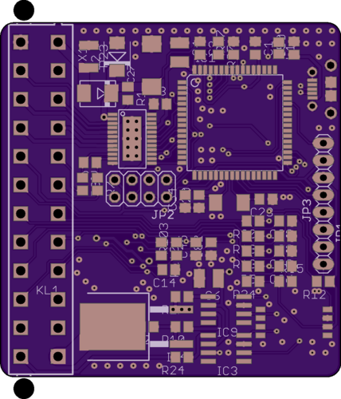
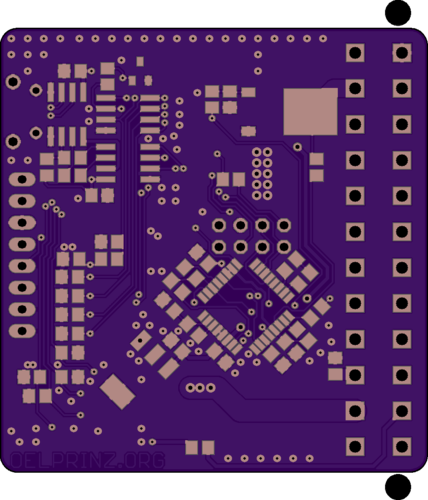
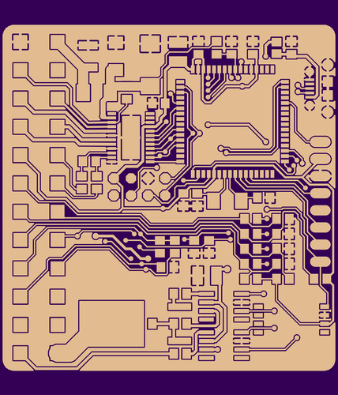

# blitzbox2561cj125
mini-sized ECU for speeduino firmware (50.1 x 58.6 mm)

2 injectors 
3 active ignition coils or 1 passive ignition coil with separate ground plane 
1 crankshaft sensor with VR-conditioner 
5 analog inputs: CLT, IAT, TPS, BAT, onboard MAP (4250 or 6400) 

Onboard Wideband Lambda Controller with Bosch CJ125 (LSU 4.9) 

1 fuel pump out 

1 idle valve out 
1 tacho out 

XXXX free and non-wired general purpose I/O's 
USB programming interface with PL2303SA (Tunerstudio) 

all in/outputs can be programmed different

[Link to the original speeduino project](https://www.speeduino.com "speeduino homepage")

  
   
    
  

